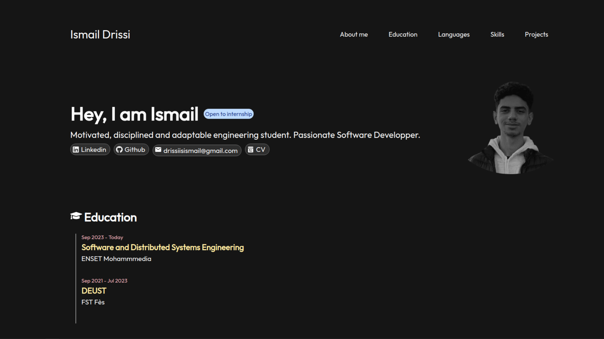

# Portfolio Website

Welcome to the repository for my portfolio website built with React! This website showcases my projects, skills, and experiences. Below you'll find all the necessary information to get started with this project.

## Table of Contents
- [Project Overview](#project-overview)
- [Features](#features)
- [Technologies Used](#technologies-used)
- [Getting Started](#getting-started)
  - [Prerequisites](#prerequisites)
  - [Installation](#installation)
- [Usage](#usage)
- [Pictures](#pictures)

## Project Overview
This is a personal portfolio website built using React. It serves as a platform to showcase my skills, projects, and professional experiences. The website is designed to be responsive, interactive, and easy to navigate.

## Features
- Home page with a brief introduction
- About section with personal information and background
- Skills section displaying technical proficiencies
- Projects section showcasing various projects with details and links
- Contact form to get in touch

## Technologies Used
- React
- React Router
- HTML5
- CSS3 (with a preprocessor like SASS/SCSS)
- JavaScript

## Getting Started

### Prerequisites
Make sure you have the following installed on your system:
- Node.js
- npm or yarn

### Installation
1. Clone the repository:
   ```bash
   git clone https://github.com/your-username/portfolio-website.git
   ```
2. Navigate to the project directory:
   ```bash
   cd portfolio-website
   ```
3. Install the dependencies:
   ```bash
   npm install
   ```
   or
   ```bash
   yarn install
   ```

## Usage
To run the project locally, use:
```bash
npm start
```
or
```bash
yarn start
```
This will start the development server and you can view the website by navigating to `http://localhost:3000` in your web browser.

To build the project for production, use:
```bash
npm run build
```
or
```bash
yarn build
```
This will create an optimized build of the project in the `build` directory.

## Pictures 



---

Thank you for checking out my portfolio website project! I hope you find it useful and informative.
